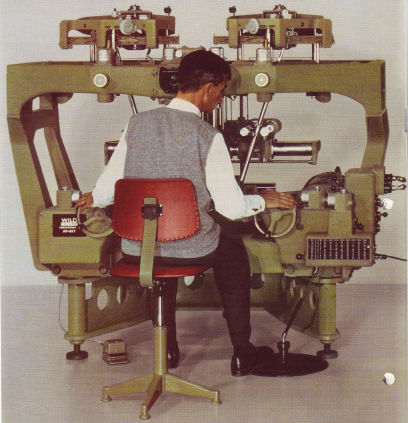

## Key Concepts and Theory of Operation

Visión binocular. Apreciación de la percepción.

Analogue Photogrammetry. Planos topográficos.

SFM: Structure from motion.

Feature detection: comparación de puntos de vista a partir de identificación de pixeles.

Tiene que haber solape entre una fotografía y la siguiente (60-70% ???).
(30-40%) si tiene más puntos de referencia en la base (papel de revista).

---
3 Anillos distintas alturas.
Homogeneidad de las tomas.
	- Grados entre toma y toma.
	- Mismo diafragma y velocidad de obturación.
	- Exposición similar entre todas las tomas.
- (la parte que está desenfocada, el programa lo desprecia).
	- Misma distancia focal para todas las tomas.
	- 
Diafragma casi lo más cerrado posible (abrilo uno o dos puntos)  
Enfocar un poco más hacia el interior del modelo. Para intentar que el modelo esté lo máximo posible dentro de la profundidad de campo de la toma.  
ISO mínimo. Minimizar ruido.  
RAW  
Número de imágenes. (en función de la calidad de las fotos que le estemos aportando).  
150 imágenes 200.  
40 imágenes (selección muy muy buenas tomas)  
Aportar más imágenes no necesariamente mejor las resultados. Mejor, que las fotos sean de mejor calidad.  

## Trabajar con varias series de tomas distintas.
Relacionar varias tomas:
	- cambiando el objeto.
	- tomas generales, tomas de detalle.

- El albedo, lo más "correcto" posible, cuando no hay sombras arrojadas. Las tomas se hacen con luz muy difusa.

----
modelo vivo vs "naturaleza muerta"  
Multicam vs. camara única.  
tiempos de captura.  

[verónica](https://www.factum-arte.com/pag/714/The-Veronica-Chorographic-Scanner)

-------
Reality Capture: NVIDIA  
Agisoft Photoscan:   
Meshroom:   

# Atmospheric conditions.

## Rotatry Table

360º /15º-> 24 tomas  
360º/ 10º-> 36 tomas  
360º/  5º-> 72 tomas  

## Camera Settings and Considerations

	- Objetivo: Tele, Normal, vs Gran Angular.

## Workflow

- Alinear fotos.
- Crear nube de puntos (Point Cloud)
- Generar malla.
	'High Detail' (tope. No me generes más de 20M poligonos)
- Color point cloud.
- Generate texture.

Cráneo en bruto	-> 2GB  
2M polígonos.	-> 329 MB  

## Post-procesado
### Decimado:  
 Con Meshlab.  
 Con Blender.  
 Con LoD CLI tool. (Level of Detail)  

### Fill holes:
 Blender  
 Meshmixer..  
 etc  

Reference & further info:  
https://gistbok.ucgis.org/bok-topics/2021-quarter-03/aerial-photography-history-and-georeferencing  
https://wild-heerbrugg.ch/en/produkte/photogrammetrie-photogrammetry
